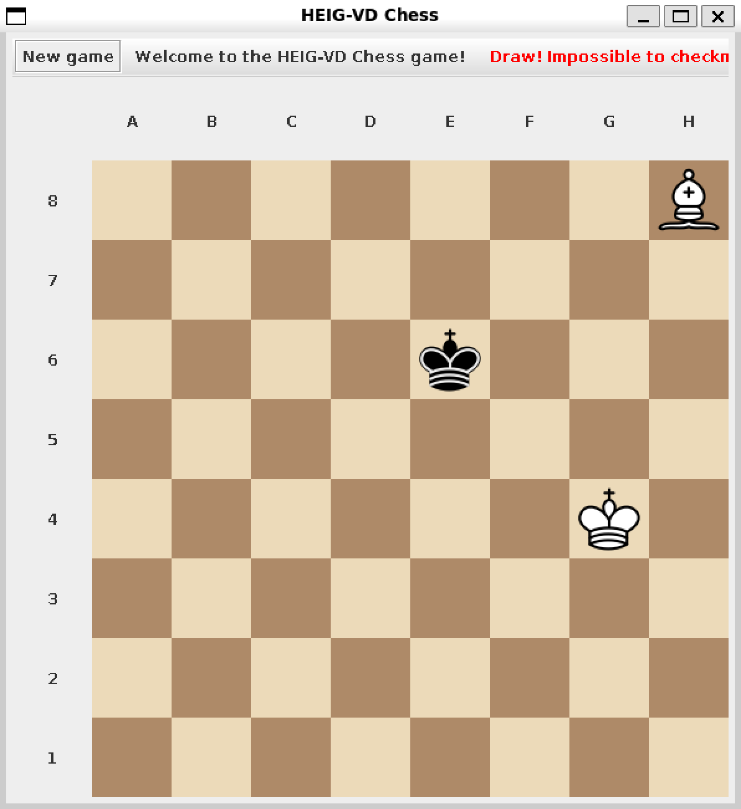

\newpage

# Introduction

L'objectif de ce laboratoire est de développer un jeu d'échecs fonctionnel
respectant les règles de base. Le projet inclut les fonctionnalités suivantes:
déplacements des pièces, coups spéciaux (roque, prise en passant, promotion des
pions) et gestion des états de jeu (par exemple, échec). Les objectifs bonus
consistent à implémenter la détection de l'échec et mat ainsi que du pat.

Pour simplifier le développement, les éléments suivants nous ont été fournis:

- **Enums:** `PieceType` pour les types de pièces et `PlayerColor` pour les
  couleurs des joueurs.
- **Interfaces:** `ChessController` et `ChessView` pour la gestion du jeu et de
  l'interface utilisateur.
- **Vues préconstruites:** Une vue graphique (`GUIView`) et une vue en mode
  texte (`ConsoleView`).

L'implémentation se concentre sur un nouveau package `engine` qui encapsule la
logique du jeu tout en exploitant les interfaces fournies pour l’interaction.

---

# Conception et Architecture

Notre approche respecte les principes de conception orientée objet, en
garantissant l'encapsulation, la réutilisabilité et la modularité. Le package
`engine` contient les classes et la logique pour la gestion du jeu, le suivi de
l'état de l'échiquier et la génération des mouvements.

## Structure

Comme montionné précédament, le notre implémentation se situe dans le package
`engine`.

```{=latex}
\dirtree{%
.1 .
.2 app\DTcomment{point d'entrée de l'application}.
.2 chess\DTcomment{\textit{code founi}}.
.2 engine\DTcomment{notre implémentation}.
.3 board\DTcomment{logique de l'échiquier}.
.3 generator\DTcomment{génération de mouvements possibles pour les pieces}.
.3 move\DTcomment{gestion des différents mouvements}.
.3 piece\DTcomment{logique des pieces d'échec}.
}
```

## Composants Clés

- **`ChessEngine`:** Gère le déroulement du jeu et communique avec le
  controlleur de l'échiquier.
- **`ChessBoardContoller`:** Expose l'échiquier en controllant la view
  (`ChessView`).
- **`ChessBoard`:** Représente l'échiquier, suit les pièces et valide les états
  du jeu.
- **`ChessBoardReader`/`ChessBoardWriter`:** Interface de lecture/écriture de
  l'échiquier.
- **`ChessPiece`:** Classe abstraite définissant le comportement commun à toutes
  les pièces, étendue par des sous-classes spécifiques.
- **`MoveGenerator`:** Classe abstraite responsable de la génération des
  mouvements possibles pour les pièces.
- **`ChessMove`:** Représente un type de mouvement aux échecs.

\newpage

## Diagramme UML

Le diagramme UML fournit une vue d'ensemble de la structure et des relations du
système. Les élements grisés représentent le code que nous avons utilisé et non
pas implémenté.

{ width=70% }

{ width=75% }

\newpage

# Caractéristiques Principales

## Détection de Fin de Jeu

Le système vérifie:

- **Checkmate:** Lorsque le roi est en échec et qu'aucun mouvement légal n'est
  possible.
- **Stalemate:** Lorsque aucun mouvement légal n'est possible, mais que le roi
  n'est pas en échec.
- **Draw:** Lorsque aucun joueur peut gagner

## Règles Spéciales

- **Roque:** Vérifie que le roi et la tour concernés n'ont pas bougé, que le
  chemin est libre et que les cases traversées ne sont pas attaquées.
- **Prise en passant:** Implémente la capture d'un pion adjacent qui a avancé de
  deux cases à son premier mouvement.
- **Promotion de pions:** Demande au joueur de choisir un type de promotion
  (tour, cavalier, fou ou dame).

---

# Tests Effectués

| **Tests effectuée**                                                                                               | **Résultat** |
| ----------------------------------------------------------------------------------------------------------------- | :----------: |
| Mettre le roi blanc en échec où le seule mouvement possible est l'attaque de la pièce blanche par une pièce noire |      V       |
| En Passant est uniquement pratiquable lorsque le pion adverse avance de deux cases                                |      V       |
| En passant est praticable uniquement au tour suivant et pas 2 tours après                                         |      V       |
| Le roque est uniquement praticable si le roi et la tour en question n'ont pas bougé                               |      V       |
| Le roque est pratiquable uniquement si les cases sur lesquelles passe le roi ne sont pas attaquées                |      V       |
| Les pions peuvent avancer de deux cases uniquement lors de leur premier déplacement                               |      V       |
| Chaque pièce avance dans la bonne direction                                                                       |      V       |
| Uniquement les chevaux peuvent sauter des pièces                                                                  |      V       |
| Les pièces ne peuvent pas découvrir un échec                                                                      |      V       |
| Le roi ne peut pas se mettre en échec                                                                             |      V       |
| Lorsque le roi est en échec, uniquement les mouvements de défenses sont praticables                               |      V       |
| Une pièce ne peut que capturer les pièces d'une autre couleur                                                     |      V       |
| Un pion peut être promu en reine, fou, chevalier ou tour                                                          |      V       |
| Un message Check s'affiche lorsque le roi est en échec et Checkmate lorsque quelqu'un a gagné                     |      V       |
| Un message Draw s'affiche lorsqu'il n'est plus possible de faire un checkmate avec le matériel restant            |      V       |

## Défense par l'attaque

Les images suivantes montrent que le joueur blanc est obligé d'attaque le fou en
H4 avec le cavalier en F3 afin de défendre son roi.

```{=latex}
\begin{figure}
\centering
\begin{minipage}{.5\textwidth}
  \centering
  \includegraphics[width=.9\linewidth]{images/checks/king_no_move.png}
  \captionof{figure}{Le roi est bloqué}
\end{minipage}%
\begin{minipage}{.5\textwidth}
  \centering
  \includegraphics[width=.9\linewidth]{images/checks/knight_move.png}
  \captionof{figure}{Le cavalier peut défendre le roi}
\end{minipage}
\end{figure}
```

## Checkmate

Cette image montre que notre jeu est capable de détecter un échec et mat.

{ width=200px }

## Stalemate

Cette image montre que notre jeu est capable de détecter un pat.

{ width=200px }

## Draw

Nous observons sur l'image suivante le message d'égalité dû au manque de pièces
pour effectuer un échec et mat.

{ width=200px }

## En Passant

Sur les deux images ci-dessous, nous pouvons observer que notre jeu propose
l'attaque En Passant et permet de l'exécuter.

```{=latex}
\begin{figure}
\centering
\begin{minipage}{.5\textwidth}
  \centering
  \includegraphics[width=.9\linewidth]{images/en_passant/show_move.png}
  \captionof{figure}{Le pion a la possibilité de capturer En Passant}
\end{minipage}%
\begin{minipage}{.5\textwidth}
  \centering
  \includegraphics[width=.9\linewidth]{images/en_passant/capture.png}
  \captionof{figure}{Le pion capture En Passant}
\end{minipage}
\end{figure}
```

## Castling

Les trois images suivantes montrent qu'il n'est pas possible d'effectuer un
castling si les cases du passage du roi sont attaquées.

```{=latex}
\begin{figure}
\centering
\begin{minipage}{.5\textwidth}
  \centering
  \includegraphics[width=.9\linewidth]{images/castling/part1.png}
  \captionof{figure}{Le roi est bloqué car les cases sont attaquées}
\end{minipage}%
\begin{minipage}{.5\textwidth}
  \centering
  \includegraphics[width=.9\linewidth]{images/castling/part2.png}
  \captionof{figure}{Le roi peut effectuer un roque}
\end{minipage}
\end{figure}
```

{ width=200px }

## Promotion

Ci-dessous, nous observons qu'il est possible de promouvoir un pion en reine,
tour, fou ou cavalier à l'aide d'une fenêtre de sélection.

```{=latex}
\begin{figure}
\centering
\begin{minipage}{.5\textwidth}
  \centering
  \includegraphics[width=.9\linewidth]{images/promotion/game_state.png}
  \captionof{figure}{Le pion est prêt à être promu}
\end{minipage}%
\begin{minipage}{.5\textwidth}
  \centering
  \includegraphics[width=.9\linewidth]{images/promotion/piece_selection.png}
  \captionof{figure}{Le joueur peut choisir la promotion du pion}
\end{minipage}
\end{figure}
```

{ width=200px }

---

# Extensions

L'implémentation étend les fonctionnalités au-delà des exigences de base:

- **Logique Réutilisable:** La génération des mouvements est abstraite dans des
  classes réutilisables, simplifiant les extensions et les futures
  modifications.
- **Gestion des États de Jeu:** La détection de l'échec et mat et du pat
  améliore l'expérience utilisateur et respecte les règles réelles des échecs.

## Génération des Mouvements

La hiérarchie `MoveGenerator` encapsule la logique de génération des mouvements
:

- **`DirectionalGenerator`:** Pour les mouvements linéaires (par exemple, tour,
  fou).
- **`KnightGenerator`:** Pour les mouvements en L propres aux cavaliers.
- **`DistanceGenerator`:** Gère les mouvements avec des portées variables, comme
  les pions.

## Gestion des États de Jeu

TODO

\newpage

# Conclusion

Ce projet a renforcé les principes de programmation orientée objet tout en
abordant des règles et interactions complexes. Les défis ont inclus:

- Garantir l'encapsulation tout en gérant les comportements variés des pièces.
- Traiter les cas limites dans les coups spéciaux et les conditions de fin de
  jeu.

Améliorations futures possibles:

- Ajouter une IA pour un mode solo.
- Proposer des suggestions de mouvements ou mettre en évidence les mouvements
  valides pour améliorer l’expérience utilisateur.

\newpage \appendix

# Annexes

## Listing Java

c.f. page suivante.
