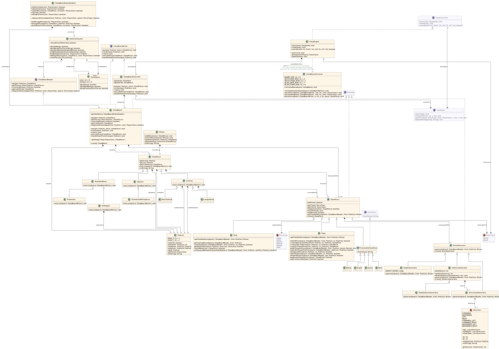

\newpage

# Introduction

L'objectif de ce laboratoire est de développer un jeu d'échecs fonctionnel
respectant les règles de base. Le projet inclut les fonctionnalités suivantes:
déplacements des pièces, coups spéciaux (roque, prise en passant, promotion des
pions) et gestion des états de jeu (par exemple, échec). Les objectifs bonus
consistent à implémenter la détection de l'échec et mat, du pat et
l'impossibilité de mater.

Pour simplifier le développement, les éléments suivants nous ont été fournis:

- **Enums:** `PieceType` pour les types de pièces et `PlayerColor` pour les
  couleurs des joueurs.
- **Interfaces:** `ChessController` et `ChessView` pour la gestion du jeu et de
  l'interface utilisateur.
- **Vues pré-construites:** Une vue graphique (`GUIView`) et une vue en mode
  texte (`ConsoleView`).

L'implémentation se concentre sur un nouveau package `engine` qui encapsule la
logique du jeu tout en exploitant les interfaces fournies pour l'interaction.

Le rendu est composé de 2 versions:

- Sans modifications au package `chess` fourni
- Avec modifications au package `chess` fourni (c.f.
  [[Extensions]{.underline}](#extensions))

---

# Conception et Architecture

Notre approche respecte les principes de conception orientée objet, en
garantissant l'encapsulation, la réutilisabilité et la modularité. Le package
`engine` contient les classes et la logique pour la gestion du jeu, le suivi de
l'état de l'échiquier et la génération des mouvements.

## Structure

Comme mentionné précédemment, notre implémentation se situe dans le package
`engine`.

```{=latex}
\dirtree{%
.1 .
.2 app\DTcomment{point d'entrée de l'application}.
.2 chess\DTcomment{\textit{code founi}}.
.2 engine\DTcomment{notre implémentation}.
.3 board\DTcomment{logique de l'échiquier}.
.3 generator\DTcomment{génération de mouvements possibles pour les pièces}.
.3 move\DTcomment{gestion des différents mouvements}.
.3 piece\DTcomment{logique des pièces d'échec}.
}
```

\newpage

## Composants Clés

- **`ChessEngine`:** Gère le déroulement du jeu et communique avec le contrôleur
  de l'échiquier.
- **`ChessBoardContoller`:** Expose l'échiquier en contrôlant la view
  (`ChessView`).
- **`ChessBoard`:** Représente l'échiquier, suit les pièces et valide les états
  du jeu.
- **`ChessBoardReader`/`ChessBoardWriter`:** Interface de lecture/écriture de
  l'échiquier.
- **`ChessPiece`:** Classe abstraite définissant le comportement commun à toutes
  les pièces, étendue par des sous-classes spécifiques.
- **`MoveGenerator`:** Classe abstraite responsable de la génération des
  mouvements possibles pour les pièces.
- **`ChessMove`:** Représente un type de mouvement aux échecs.

## Détails de Conception

**Séparation `ChessBoard` et `ChessBoardContoller`**

Nous avons découplé la logique de l'échiquier avec la mise à jour de la vue
(`ChessView`) afin de pouvoir cloner l'échiquier sans être lié à la vue.

Cela nous permet d'exécuter des mouvements sur la classe `ChessBoardContoller`
pour mettre à jour l'interface et exécuter des mouvements sur la classe
`ChessBoard` sans mettre à jour l'interface.

\vspace{1em}

**Interfaces `ChessBoardReader` et `ChessBoardWriter`**

Pour encapsuler l'échiquier, deux interfaces limitent l'accès de `ChessBoard`.

Par exemple, une pièce d'échec est uniquement intéressée à lire l'état de
l'échiquier pour générer différents types de mouvements. Alors qu'un mouvement
(`ChessMove`) doit pouvoir modifier l'état de l'échiquier.

\vspace{1em}

**Classe Abstraite `PromotableChessPiece`**

Le rôle de cette classe est d'implémenter l'interface `UserChoice` fournie afin
d'avoir une représentation textuelle pour l'utilisateur de l'interface de la
pièce lors d'une promotion.

\newpage

## Diagramme UML

Le diagramme UML fournit une vue d'ensemble de la structure et des relations du
système. Les éléments grisés représentent le code que nous avons utilisé, mais
que nous n’avons pas implémenté nous-mêmes.

{ width=70% }

{ width=75% }

\newpage

# Caractéristiques Principales

Notre jeu implémente les fonctionnalités suivantes pour une partie de joueur
contre joueur:

- Les mouvements de base des pièces (pion, tour, cavalier, fou, reine, roi).
- La capture des pièces adverses.
- Le petit et le grand roque
- La prise en passant
- La promotion des pions en avançant
- La promotion des pions en capturant
- La détection et l'affichage de:
  - L'échec
  - L'échec et mat
  - Le pat
  - L'impossibilité de mater

## Règles Spéciales

- **Roque:** Vérifie que le roi et la tour concernés n'ont pas bougé, que le
  chemin est libre et que les cases traversées ne sont pas attaquées.
- **Prise en passant:** Implémente la capture d'un pion adjacent qui a avancé de
  deux cases à son premier mouvement.
- **Promotion de pions:** Demande au joueur de choisir un type de promotion
  (tour, cavalier, fou ou dame).

---

# Tests Effectués

| **Tests effectués**                                                                                               | **Résultat** |
| ----------------------------------------------------------------------------------------------------------------- | :----------: |
| Mettre le roi blanc en échec où le seule mouvement possible est l'attaque de la pièce blanche par une pièce noire |     Vrai     |
| En Passant est uniquement pratiquable lorsque le pion adverse avance de deux cases                                |     Vrai     |
| En passant est praticable uniquement au tour suivant et pas 2 tours après                                         |     Vrai     |
| Le roque est uniquement praticable si le roi et la tour en question n'ont pas bougé                               |     Vrai     |
| Le roque est pratiquable uniquement si les cases sur lesquelles passe le roi ne sont pas attaquées                |     Vrai     |
| Les pions peuvent avancer de deux cases uniquement lors de leur premier déplacement                               |     Vrai     |
| Chaque pièce avance dans la bonne direction                                                                       |     Vrai     |
| Uniquement les chevaux peuvent sauter des pièces                                                                  |     Vrai     |
| Les pièces ne peuvent pas découvrir un échec                                                                      |     Vrai     |
| Le roi ne peut pas se mettre en échec                                                                             |     Vrai     |
| Lorsque le roi est en échec, uniquement les mouvements de défenses sont praticables                               |     Vrai     |
| Une pièce ne peut que capturer les pièces d'une autre couleur                                                     |     Vrai     |
| Un pion peut être promu en reine, fou, chevalier ou tour                                                          |     Vrai     |
| Un message Check s'affiche lorsque le roi est en échec et Checkmate lorsque quelqu'un a gagné                     |     Vrai     |
| Un message Draw s'affiche lorsqu'il n'est plus possible de faire un checkmate avec le matériel restant            |     Vrai     |

## Défense par l'attaque

Les images suivantes montrent que le joueur blanc est obligé d'attaque le fou en
H4 avec le cavalier en F3 afin de défendre son roi.

```{=latex}
\begin{figure}
\centering
\begin{minipage}{.5\textwidth}
  \centering
  \includegraphics[width=.9\linewidth]{assets/checks/king_no_move.png}
  \captionof{figure}{Le roi est bloqué}
\end{minipage}%
\begin{minipage}{.5\textwidth}
  \centering
  \includegraphics[width=.9\linewidth]{assets/checks/knight_move.png}
  \captionof{figure}{Le cavalier peut défendre le roi}
\end{minipage}
\end{figure}
```

## Checkmate

Cette image montre que notre jeu est capable de détecter un échec et mat.

{ width=175px }

## Stalemate

Cette image montre que notre jeu est capable de détecter un pat.

{ width=200px }

## Draw

Nous observons sur l'image suivante le message d'égalité dû au manque de pièces
pour effectuer un échec et mat.

{ width=200px }

\newpage

## En Passant

Sur les deux images ci-dessous, nous pouvons observer que notre jeu propose
l'attaque En Passant et permet de l'exécuter.

```{=latex}
\begin{figure}
\centering
\begin{minipage}{.5\textwidth}
  \centering
  \includegraphics[width=.9\linewidth]{assets/en_passant/show_move.png}
  \captionof{figure}{Le pion a la possibilité de capturer En Passant}
\end{minipage}%
\begin{minipage}{.5\textwidth}
  \centering
  \includegraphics[width=.9\linewidth]{assets/en_passant/capture.png}
  \captionof{figure}{Le pion capture En Passant}
\end{minipage}
\end{figure}
```

## Castling

Les trois images suivantes montrent qu'il n'est pas possible d'effectuer un
castling si les cases du passage du roi sont attaquées.

```{=latex}
\begin{figure}
\centering
\begin{minipage}{.5\textwidth}
  \centering
  \includegraphics[width=.9\linewidth]{assets/castling/castling-next-square-attacked.png}
  \captionof{figure}{Le roi est bloqué car la case à côté est attaquée}
\end{minipage}%
\begin{minipage}{.5\textwidth}
  \centering
  \includegraphics[width=.9\linewidth]{assets/castling/castling-king-attacked.png}
  \captionof{figure}{Le roi est bloqué car il est attaqué}
\end{minipage}
\end{figure}
```

```{=latex}
\begin{figure}
\centering
\begin{minipage}{.5\textwidth}
  \centering
  \includegraphics[width=.9\linewidth]{assets/castling/part2.png}
  \captionof{figure}{Le roi peut effectuer un roque}
\end{minipage}%
\begin{minipage}{.5\textwidth}
  \centering
  \includegraphics[width=.9\linewidth]{assets/castling/part3.png}
  \captionof{figure}{Le roi a effectué le roque}
\end{minipage}
\end{figure}
```

## Promotion

Ci-dessous, nous observons qu'il est possible de promouvoir un pion en reine,
tour, fou ou cavalier à l'aide d'une fenêtre de sélection.

```{=latex}
\begin{figure}
\centering
\begin{minipage}{.5\textwidth}
  \centering
  \includegraphics[width=.9\linewidth]{assets/promotion/game_state.png}
  \captionof{figure}{Le pion est prêt à être promu}
\end{minipage}%
\begin{minipage}{.5\textwidth}
  \centering
  \includegraphics[width=.9\linewidth]{assets/promotion/piece_selection.png}
  \captionof{figure}{Le joueur peut choisir la promotion du pion}
\end{minipage}
\end{figure}
```

{ width=200px }

---

# Extensions

## Génération des Mouvements

La hiérarchie `MoveGenerator` encapsule la logique de génération des mouvements:

- **`DirectionalGenerator`:** Pour les mouvements directionnels.
- **`DistanceGenerator`:** Gère les mouvements avec des portées variables, comme
  les pions.
- **`KnightGenerator`:** Pour les mouvements en L propres aux cavaliers.
- **`PawnDistanceGenerator`:** Spécialise `DistanceGenerator` pour autoriser le
  mouvement de 2 cases quand le pion n'as pas encore bougé, puis 1 seule case.

Au point de vue conception, la classe `DistanceGenerator` peut utiliser une
liste de `DirectionalGenerator` pour obtenir les mouvements d'une distance
maximum avec de la directionnalité.

Par exemple, le roi, peut se déplacer dans tous les sens, mais d'une seule case
à la fois.

## Gestion des États de Jeu

La logique de détection des états de jeu est encapsulée dans la classe
`ChessBoard`. Chaque cas est vérifié de la manière suivante:

- **Échec et Mat (Checkmate):** Vérifie si le roi est en échec et qu'il n'a
  aucun mouvement légal disponible.
- **Pat (Stalemate):** Vérifie que le roi n'est pas en échec et qu'aucun
  mouvement légal n'est disponible.
- **Impossibilité de mater (Draw):** Vérifie qu'il n'y a plus de matériel
  nécessaire pour mater. C'est-à-dire, qu'il vérifie si une des 4 situations
  suivantes est vraie:
  - Les deux joueurs n'ont plus que leur roi.
  - L'un des joueurs n'a plus que son roi et l'autre joueur n'a plus que son roi
    et un fou.
  - L'un des joueurs n'a plus que son roi et l'autre joueur n'a plus que son roi
    et un cavalier.
  - Chaque joueur a un roi et un fou, mais les deux fous sont sur des cases de
    la même couleur.

## Package `chess`

Nous avons aussi apporté quelques modifications au package `chess` fourni. Comme
mentionné dans l'introduction, nous avons fourni deux versions qui
incluent/excluent ces modifications.

\vspace{1em}

**Changements Esthétiques**

Nous avons modifié les images des pions ainsi que les couleurs de l'échiquier.
Les images sont sous licence AGPL-3.0 et proviennent du projet Lichess[^1].

[^1]: https://github.com/lichess-org/lila/tree/master/public/piece/cburnett

\vspace{1em}

**Soulignement des Mouvements Possibles**

Lorsqu'un utilisateur clique sur une pièce, les cases où la pièce peut bouger
sont surlignées. Cette fonctionnalité nous a aidé à déboguer les mouvements de
pièces.

Pour implémenter cela, nous avons rajouté la méthode suivante dans `ChessView`:

```java
/**
 * Highlights with a green dot the given positions
 *
 * @param pos the list of positions
 */
void highlightPositions(List<Position> pos);
```

Et nous avons rajouté la méthode suivante dans `ChessController`:

```java
/**
 * Called when the user selects a piece on the board
 *
 * @param x the piece x position
 * @param y the piece y position
 */
void select(int x, int y);
```

Cela nous permet de réagir aux évènements 'select' afin de souligner les
mouvements possibles.

\newpage

# Conclusion

Ce projet a renforcé les principes de programmation orientée objet tout en
abordant des règles et interactions complexes. Les défis ont inclus:

- Garantir l'encapsulation tout en gérant les comportements variés des pièces.
- Traiter les cas limites dans les coups spéciaux et les conditions de fin de
  jeu.

Améliorations futures possibles:

- Ajouter une IA pour un mode solo.
- Proposer des suggestions de mouvements pour améliorer l'expérience
  utilisateur.

\newpage

\appendix

# Annexes

## Listing Java

c.f. page suivante.
